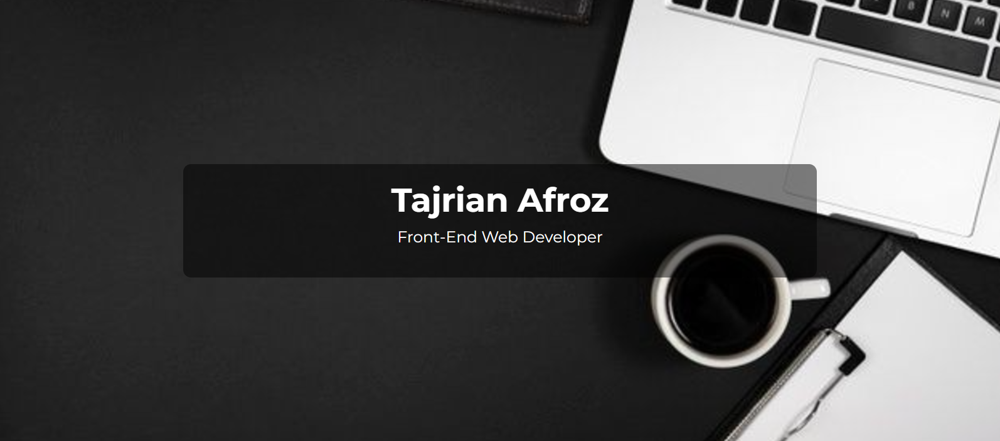

# Hi 👋, I'm Tajrian Afroz
### Frotnend web developer

I'm a dedicated Frontend Web Developer with a passion for building seamless, responsive, and visually captivating websites. Skilled in HTML, CSS and JavaScript and  I am continuously enhancing my skills with frameworks like React. I enjoy turning creative ideas into functional and engaging web solutions. 

I’m always excited to learn new technologies and take on challenging projects that push the boundaries of front-end development. Let’s connect if you’re interested in discussing innovative ideas or potential collaborations!

Skills:  HTML5/ CSS/ BOOTSTRAP/ JAVASCRIPT/ JQUERY.

- 🌱 I’m currently learning React 
- 👯 I’m looking to collaborate on github 
- 📫 How to reach me: tajrianafroz37@gmail.com 

      

